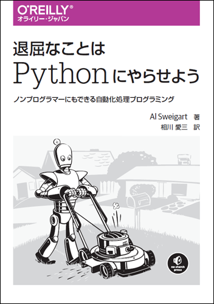

# 退屈なことはPythonにやらせよう

---

---

本リポジトリはオライリー・ジャパン発行書籍『[退屈なことはPythonにやらせよう](https://www.oreilly.co.jp/books/9784873117782/)』（原書名『[Automate the Boring Stuff with Python](https://www.nostarch.com/automatestuff)』） のサポートサイトです。

## サンプルコード

サンプルコードの解説は本書籍をご覧ください。

## 【新規】演習プロジェクトの解答例

読者の皆様のご要望が多かったため、演習プロジェクトの解答例を追加しました。
(https://github.com/oreilly-japan/automatestuff-ja/blob/master/practice_pj/practice_projects_20170727.zip)

ご購読者の特典とするため、ZIPファイルにはパスワードを設定してあります。
パスワードは、11.3.4節の本文に現れる最初の英単語3つをつなげたものです。

解答例は、以下の注意点をご了承の上お使いください。

- 訳者が独自に作成したものです。原著者のAl Sweigart氏には問い合わせないでください。
- 動作保証はしません。サンプルとしてお使いください。
- 演習プロジェクトのすべての要求を満たすものではありません。要求があいまいなものや、自由度が多すぎるものについては、適当に端折っています。
- IDやパスワード、APIキーなど、読者の環境に合わせて改変が必要なものがあります。
- 不定期に更新されることがあります。
- ZIPのパスワードは不定期に変更されることがあります。

## 正誤表

本書の正誤情報は以下のページで公開しています。

https://github.com/oreilly-japan/automatestuff-ja/wiki/errata

本ページに掲載されていない誤植など間違いを見つけた方は、[japan＠oreilly.co.jp](<mailto:japan＠oreilly.co.jp>)までお知らせください。
